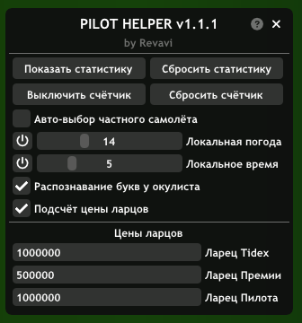
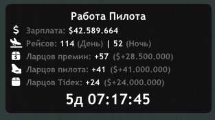

# Pilot Helper (V 1.1)

Этот скрипт создан для ведения статистики и облегчения работы пилота в _SA-MP **Arizona RP**_.

_Проверен и разрешён на Arizona RP: **Payson**_  
_Работает только с помощью **moonloader**_.  
[_Пост на blast.hk_](https://www.blast.hk/threads/178320/)

Основные функции:
 - **Может локально _(только для вас)_ изменять погоду, время**
 - **Имеет счётчик для замера времени _[(Взято отсюда)](https://www.blast.hk/threads/152172/)_**
 - **Автоматически выбирает частный самолёт**
 - **Записывает чистую зарплату, полученную за рейсы**
 - **Записывает кол-во дневных и ночных рейсов**
 - **Записывает кол-во выпавших ларцов и их общую цену**
 - **Распознавание букв у окулиста _[(Взято отсюда, но улучшенно)](https://www.blast.hk/threads/137052/)_**

## Команды скрипта:

**/pilot** - _открыть/закрыть меню_
**/ptimer** - _включить/выключить счётчик_

## Скриншоты/Видео

**Демонстрация функционала: https://www.youtube.com/watch?v=lVNL42_2M6w&ab_channel=adx**

**Основное меню:**

**Окно статистики:**

## Необходимые библиотеки
 - **[mimgui](https://github.com/THE-FYP/mimgui/releases/download/v1.7.0/mimgui-v1.7.0.zip)**
 - **[samp.lua](https://github.com/THE-FYP/SAMP.Lua/releases/download/v2.3.0/samp-lua-v2.3.0.zip)**
 - **[fAwesome6](https://cdn.discordapp.com/attachments/1038436016954036254/1038436037279617024/fAwesome6.lua)**

## Как установить

**НЕ ПУТАЙТЕ MOONLOADER И MODLOADER**

**Скрипт:**
 Скачайте [**Pilot Helper**](Pilot.Helper.lua) и перенесите его в "**_корневая папка игры_/moonloader**", затем запустите игру. Если что-то пойдёт не так, то напишите разработчику в [**telegram**](https://t.me/SosuPercocet).

**Библиотеки:**
 Скачайте каждую библиотеку, разархивируйте _(если требуется)_ и перенесите в "**_корневая папка игры_/moonloader/lib**".

## Примечания

 - *Для корректного распознавания текущего времени суток (день/ночь), нужно перед началом смены звонить в службу точного времени, если на вашем ПК время не МСК, или неправильно идёт.*
 - *Скрипт неуникальный, таких как этот много, но не все они разрешены, в отличии от моего.*
 - *Если найдёте баг или функцию, за которую банят на вашем сервере - пишите, может даже сделаю разные версии под разные сервера.*
 - *Может конфликтовать с некоторами money separator*

## Связь с разработчиком

**Discord: _Revavi#6149_**  
[**telegram**](https://t.me/SosuPercocet)  
[**VK**](https://vk.com/revavi)  
[**DonationAlerts**](https://www.donationalerts.com/r/revavi_)

## Список изменений
***Подробнее вы можете узнать в информации про релизы** (Начиная с v1.1.0)*

**V 1.0.2 >>**
 - Релиз
 
**V 1.0.3 >>**
 - Небольшая оптимизация кода
 - Измненение окна статистики
 - Разделение дневных и ночных рейсов в статистике
 
**V 1.1.0 >>**
 - Распознавание букв у окулиста
 - Учёт цены ларцов
 - Изменение цветов меню
 - Баг фикс
 - Окно статистики скрывается при открытии меню паузы

**V 1.1.1 >>**
 - Баг-фикс
 - Новые цвета меню
 - Возможность отключать/включать локальную погоду/время

**V 1.1.2 >>**
 - Незначительное изменение кода
 - Баг-фикс

**V 1.1.3 >>**
 - Баг-фикс

**v 1.1.4 >>**
 - Обновление под новый интерьер у окулиста.
 - Добавлено предупреждение о возможности наказания за использование функции "Распознавание букв у окулиста".
